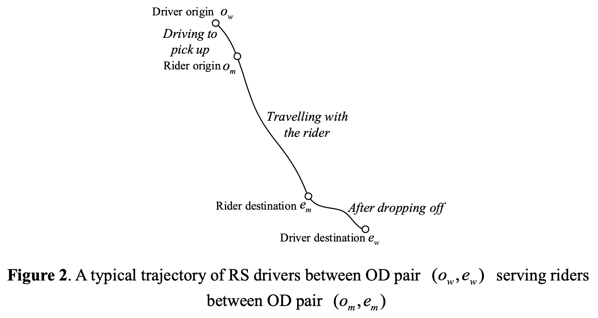
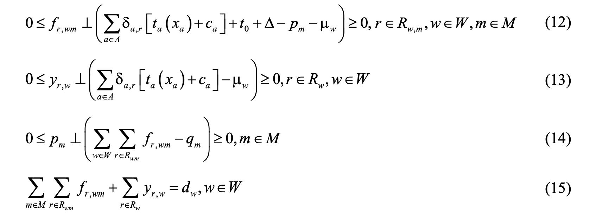
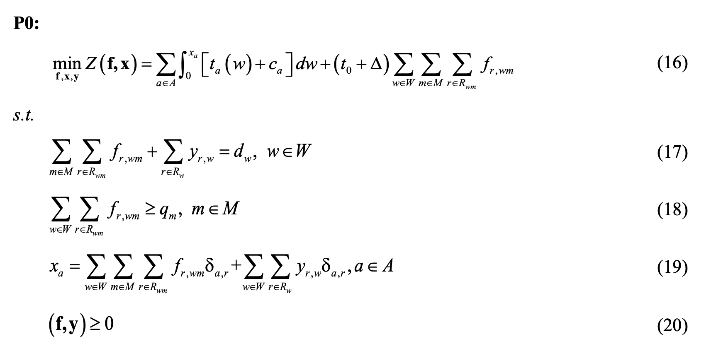

## Note for paper

[A Convex Programming Approach for Ridesharing User Equilibrium Under Fixed Driver/Rider Demand](https://papers.ssrn.com/sol3/papers.cfm?abstract_id=3589442)

Since listening to Dr. Wang's explanation to this paper for serval times, I took a note for this paper.

### Introduction

**Target**: As the development of ridesharing, which is a useful tool for congestion mitigation, the ridesharing user equilibrium(RUE) will be a important issue.

**Difference**: Existing papers mainly focused on RUE with lots of restrictions.

**What have done**: Assuming that all drivers travel with at most one RS rider, and each RS rider is served by only one driver, we redefine the set of driver trajectories with no restriction on feasible driver-rider matchings, and introduce market clearing conditions to characterize drivers’ net income from ridesharing services at market equilibrium. 

**Algorithm**: dual subgradient algorithm 

### Ridesharing Process

### Build Convex Optimization

In this paper, a convex programming approach for ridesharing user equilibrium is proposed. 

First of all, use equations to represent the RUE conditions.

Then, the RUE problem is the KKT condition of another unconstrained problem. Just prove that problem is a convex problem. 

Thirdly, prove that there is at least one RUE solution. Finally, the solution is unique.

**The whole process is similar to beckmann transformation.**

### Solve the Convex Problem

**In comparison with the classic Beckmann’s formulation, P0 has an additional side constraint. So, they penalize this side constraint to the objective and use the dual subgradient method with averaging to solve it.** 

The algorithm can ensure not only the convergence of dual solution sequences but also that of primal solution sequences. Moreover, the sub-problem has the same structure as the traditional Beckmann’s formulation, therefore enables the application of well-established Frank-Wolfe algorithm to solve it. No path or trajectory enumeration is required. 

### Conclusion

In UE problem with ridesharing, if the process of ridesharing can be well-established, the nonlinear problem can probably be converted to a convex problem. Just prove the existence and uniqueness of the solution. Then, many convex optimization algorithms can be applied to solve the convex problem. 

