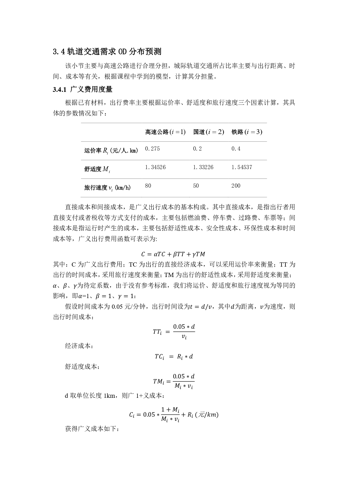
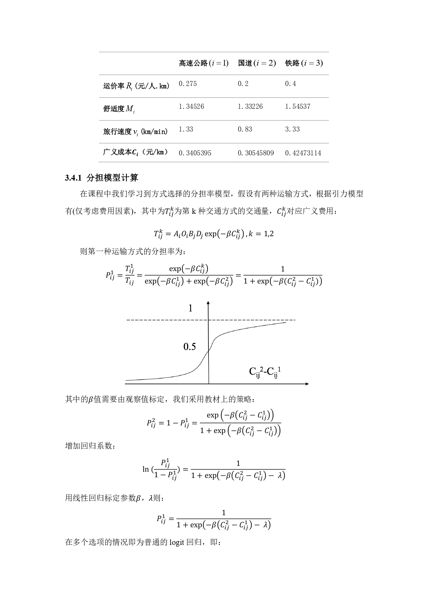
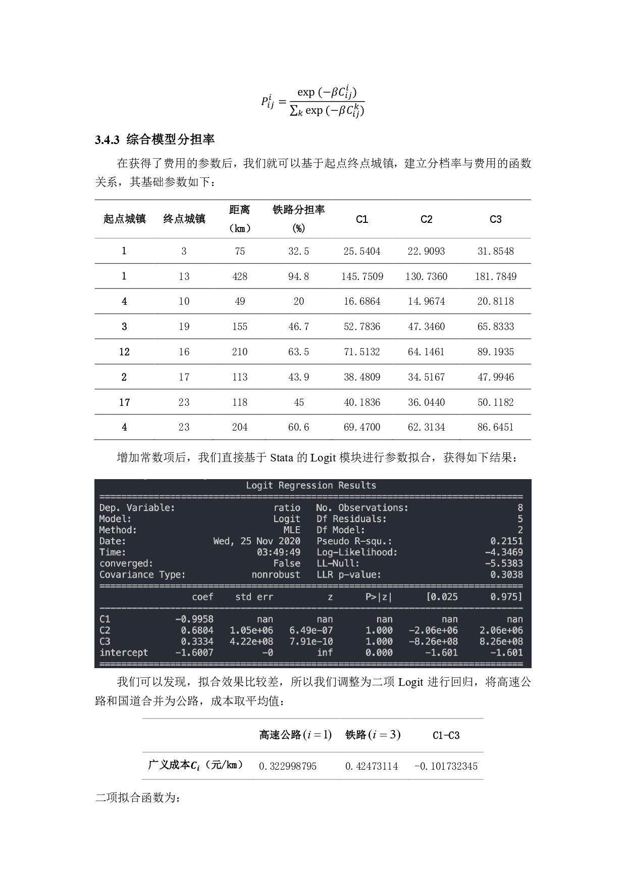
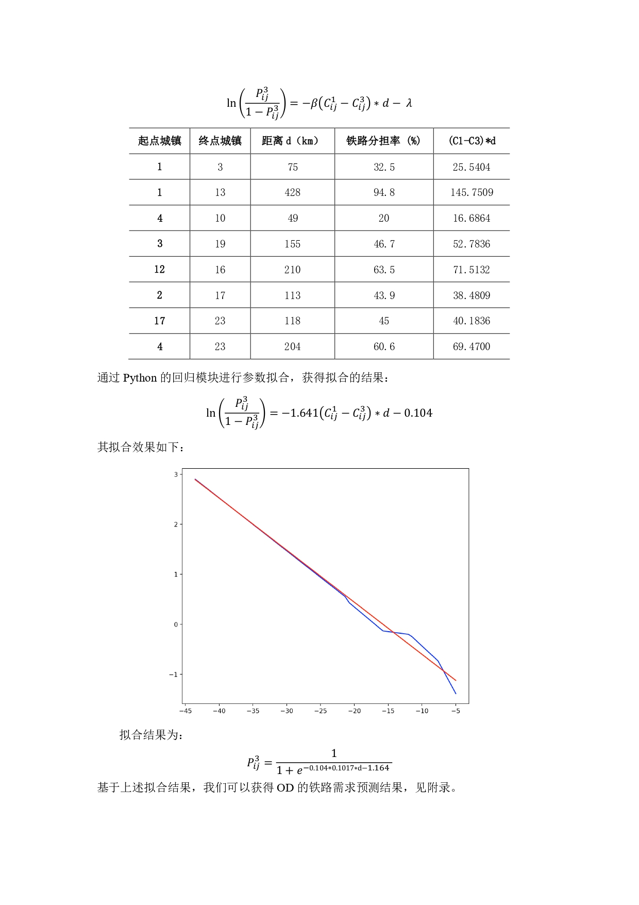

# Network Loading Project

## Problem Introduction

In this project, there are three forms of transport avaible. The price, comfort level, and velocity are introduced. Besides, current loading proportion of different ODs are known. We can apply logit model to this problem. 

Compute the general price for three approaches and than use logit regression to compare the expected and real loading ratio. When there are only two approaches 

Reference: 尚尔康,左忠义. 基于广义出行费用的多校区出行分析[A]. 中国科学技术协会、中华人民共和国交通运输部、中国工程院.2019世界交通运输大会论文集（上）

## Project Detail

