# Traffic Assignment Project

Since user equilibrium and system optimum have been introduced, this folder mainly concerns about the exact line search algorithm for solving user equilibrium.  

Besides , a course project in *Network Optimization and Modelling* lectured by Dr. Wang Xiaolei will be introduced.

- [Line Search](#line-search)
- [Solve User Equilibrium](#solve-user-equilibrium)
- [Course Project](#course-project)
  - [Requirements](#requirements)
  - [Solution](#solution)

## Line Search

### Introduction

https://www.cnblogs.com/jeromeblog/p/3801025.html

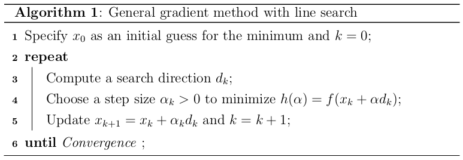

In general gradient method, we should find a search direction meet the following requirement: 

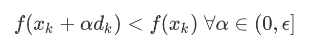

When $d_k = -\nabla f(x)$, f(x) will decrease most quickly. However, this is not the necessary condition for searching the optimum. All directions that meet $\nabla f(x_k)^Td_k<0$ is fine. In general, the search direction is presented:

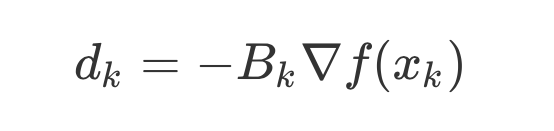

$B_k$ is positive definite matrix.

- Fast gradient descent: $B_k=I$  
- Newton Method: $B_k = H(x_k)^(-1)$ and $H(x_k)=\nabla^2f(x_k)$ is positive definite matrix

However, determine the step size is also a important problem. Neither too small nor too big will make convergence a hard thing. So, many line search algorithms are proposed

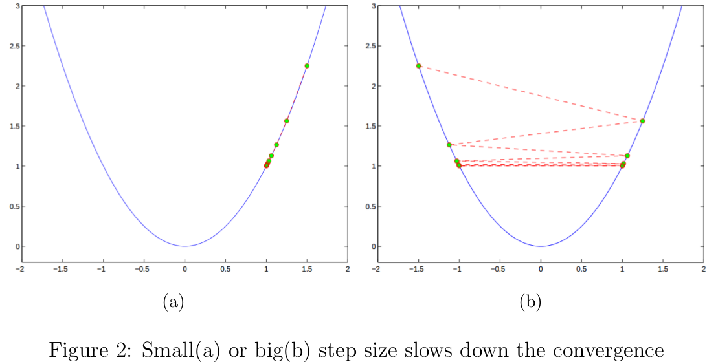

```python
def graidentDescent(fun,dfun,theta,_type="WolfLineSearch",show=False,maxiter=1e4,):
   	x,y,y_ = [theta[0]],[fun(theta)[0]],[dfun(theta)[0]]
    i = 0
    eps = 1e-6
    while i < maxiter:
        last_theta = deepcopy(theta)
        d = -dfun(theta)
     		# 通过某个方式获得步长
        if _type == "WolfLineSearch":
            stepsize = LineSearch.WolfeLineSearch(fun,dfun,theta,d)
        elif _type == "ArmijoBackTrack":
            stepsize = LineSearch.ArmijoBacktrack(fun,dfun,theta,d)
        elif _type == "ArmijoLineSearch":
            stepsize = LineSearch.ArmijoLineSearch(fun,dfun,theta,d)
        else:
            stepsize = LineSearch.WolfeLineSearch(fun,dfun,theta,d)                
        if abs(d) < eps or stepsize < eps: break
        theta = last_theta + stepsize*d
        i = i + 1
        x.append(theta[0]),y.append(fun(theta)[0]),y_.append(dfun(theta)[0])
```

### Example-Backtracking

Source Code: [Backtracking](line-search.py)

First of all, the armijo condition is a very useful method to find the range of stepsize.

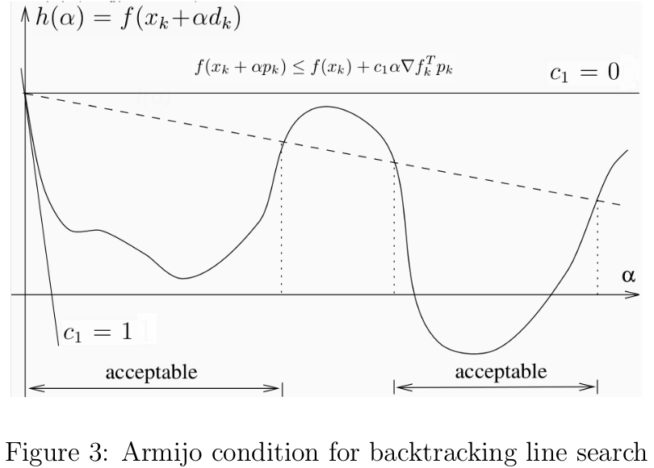

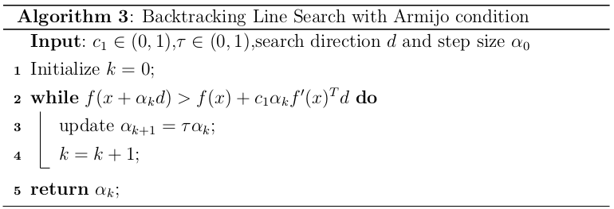

```python
def ArmijoBacktrack(fun,dfun,theta,d,args=np.array([]),stepsize=1,tau=0.5,c1=1e-3):
    slope = np.sum(dfun(theta,args)*d.T)
    obj_old = fun(theta,args)
    theta_new = theta + stepsize*d
    obj_new = fun(theta_new,args)
    while obj_new > obj_old + c1*stepsize*slope:
        stepsize *= tau
        theta_new = theta + stepsize*d
        obj_new = fun(theta_new,args)
    return stepsize
```

Use backtracking to find the exact stepsize is very efficient way. For example, the left plot is $f(x) = e^x - 2*x$ and the right plot is the process find the optimum position from x = -5.

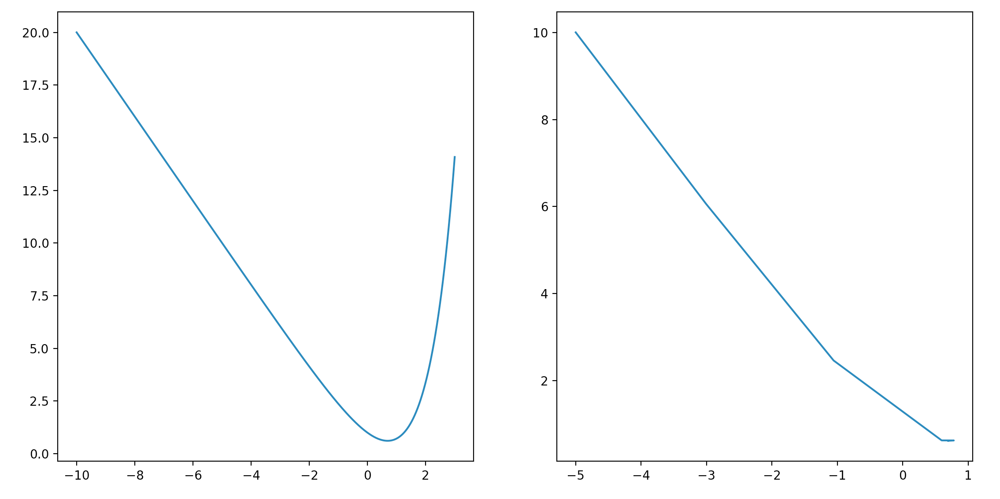

```
# Iteration Process
x [-5.000000, -3.006738, -1.056191, 0.596031, 0.781130, 0.689161, 0.697118, 0.693139, 0.693147]
f(x) [10.006738, 6.062929, 2.460159, 0.622839, 0.621679, 0.613722, 0.613721, 0.613706, 0.613706]
f(x)' [-1.993262, -1.950547, -1.652222, -0.185098, 0.183938, -0.007957, 0.007957, -0.000016, -0.000000]
```

### Other algorithm

Source Code: [Line Search.py](line_search.py)

- Wolf Search
- Newtons Method
- Quasi-Newton Method
- ......

They will be added to this readme.

## Solve User Equilibrium

After beckmann transformation, the problem is converted to convex optimization problem. Then, we can use Frank-Wolf algorithm to find the descent direction. Just determine the stepsize using line search. 1

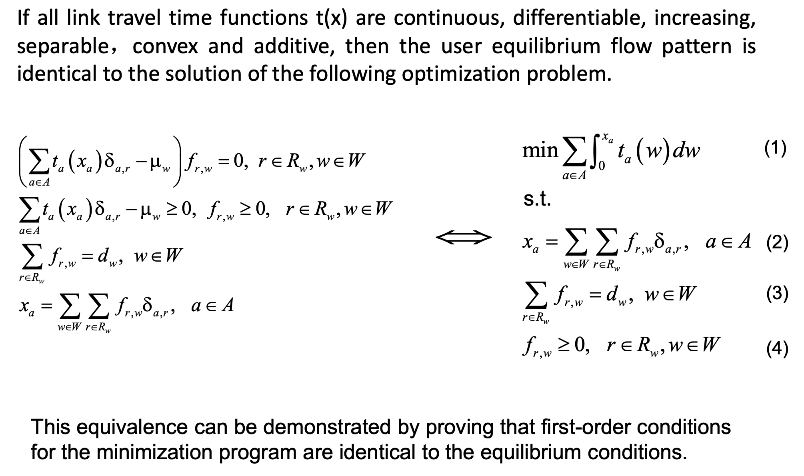

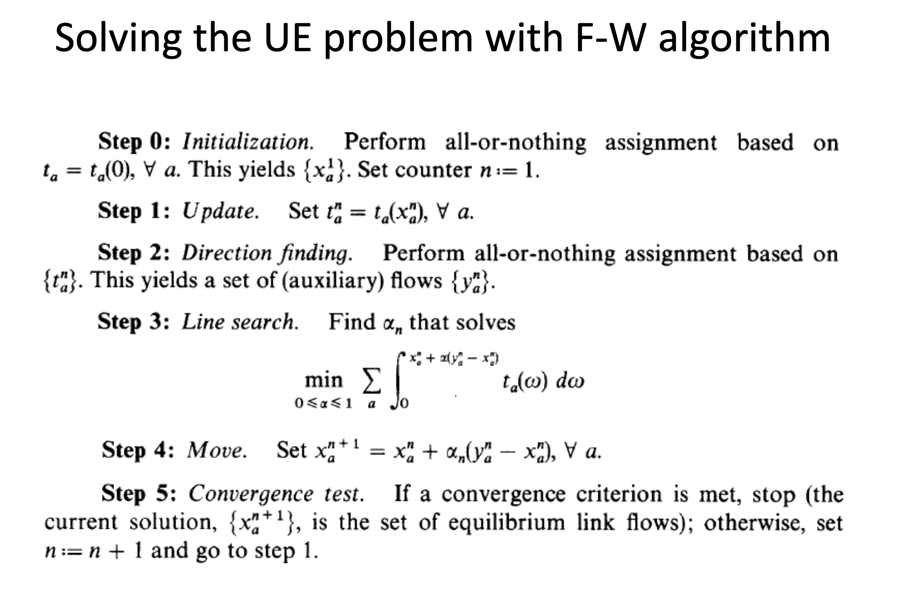

## Course Project

### Requirements

[Traffic Assignment-Course Project](Traffic Assignment-Course Project.pdf)

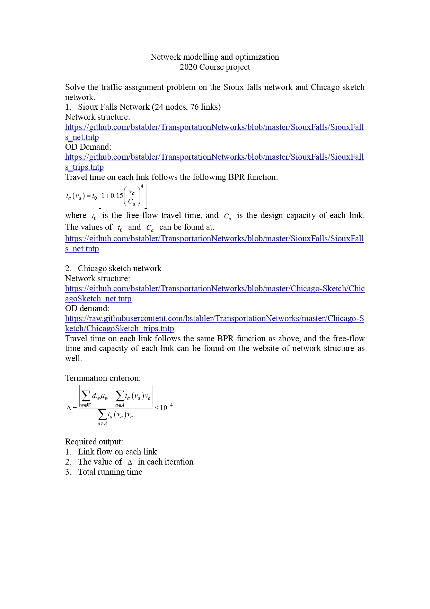

### Solution

In sioux falls network, the capacity and free flow time of a link is determined. 

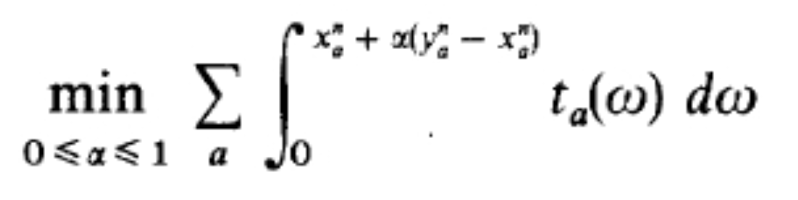

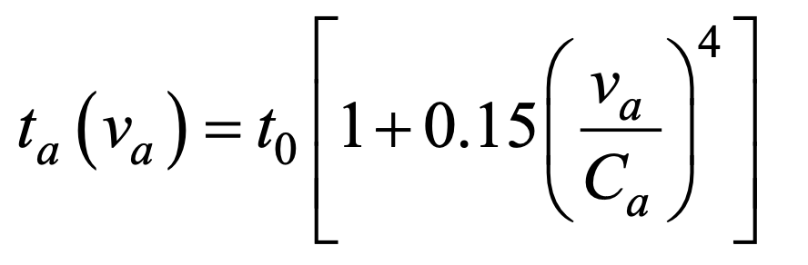

We can use the above two equations obtain a function of $\alpha$

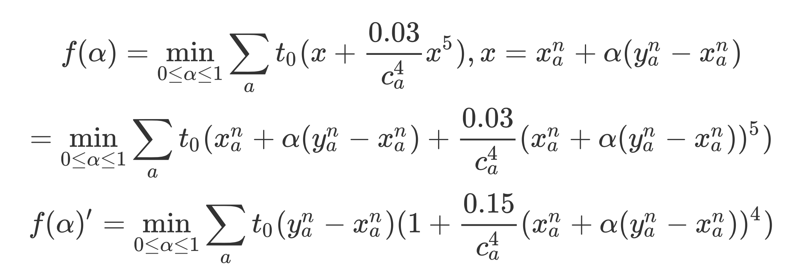
$$
f(\alpha)=\min\limits_{0\leq\alpha\leq1} \sum\limits_{a}t_0(x+\frac{0.03}{c_a^4}x^5), x=x_a^n+\alpha(y_a^n-x_a^n) \\
= \min\limits_{0\leq\alpha\leq1} \sum\limits_{a}t_0(x_a^n+\alpha(y_a^n-x_a^n)+\frac{0.03}{c_a^4}(x_a^n+\alpha(y_a^n-x_a^n))^5)
\\ f(\alpha)' = \min\limits_{0\leq\alpha\leq1} \sum\limits_{a}t_0(y_a^n-x_a^n)(1+\frac{0.15}{c_a^4}(x_a^n+\alpha(y_a^n-x_a^n))^4)
$$
After processing the network and flow, we can excute the Frank-Wolf algorithm to find the optimum $\alpha$ 

Then upadate the flow until convergence

Source Code: [solution_sious_falls.py](solution_sious_falls.py)


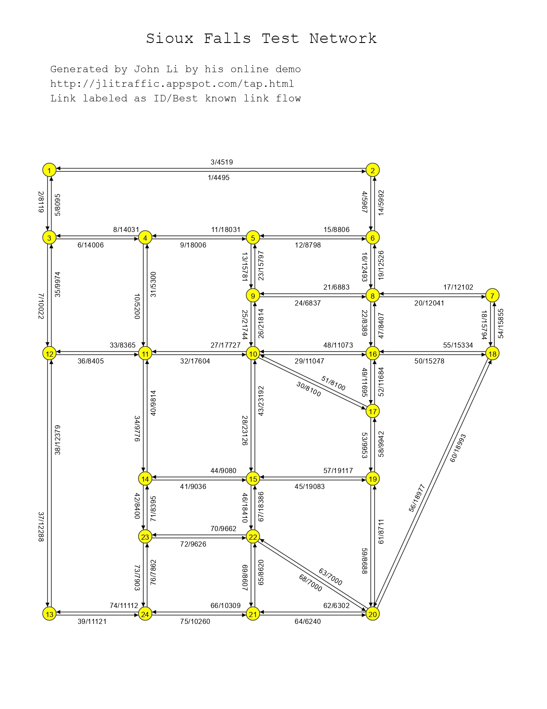

