## Content

- [Urban Transportation](#urban-transportation)
  * [BPR Function](#bpr-function)
  * [User Euqilibrium](#user-euqilibrium)
    + [Mathematical Model](#mathematical-model)
    + [Heuristic method[Project Code]](#heuristic-method)
  * [Beckmann's Transformation](#beckmann-s-transformation)
  * [Frank-Wolfe Algorithm[Project Code]](#frank-wolfe-algorithm)
  * [System Optimum](#system-optimum)
    + [Model Introduction](#model-introduction)
    + [Price of Anarchy](#price-of-anarchy)
  * [Network Loading Models](#network-loading-models)
    + [Choice Function](#choice-function)
    + [Logit-Based Loading Models[Project Code]](#logit-based-loading-models)
- [Network Problem](#network-problem)
  * [Max-Flow Problem](#max-flow-problem)
  * [Minimum Cost Flow](#minimum-cost-flow)
- [Simulation](#simulation)
  * [Random Number](#random-number)
  * [Queueing Theory](#queueing-theory)
- [Optimization Problem](#optimization-problem)
  * [Unconstrained Optimization](#unconstrained-optimization)
  * [Line Search Methods](#line-search-methods)
    + [Simple Introduction](#simple-introduction)
    + [Search Direction](#search-direction)
  * [Trust Region](#trust-region)
  * [KKT Condition](#kkt-condition)
  * [Leat-Squared Problems](#leat-squared-problems)
  * [Dual Problem](#dual-problem)
  * [Newton's Method](#newton-s-method)
  * [Quasi-Newton's Method](#quasi-newton-s-method)
  * [No-linear Equation](#no-linear-equation)
- [Integer Programming](#integer-programming)
  * [Branch and Bound](#branch-and-bound)
  * [Branch and Cut](#branch-and-cut)
  * [Branch and Price](#branch-and-price)
  * [Lagrangian Decomposition](#lagrangian-decomposition)
  * [Column Generation](#column-generation)
  * [DW Decomposition](#dw-decomposition)
  * [Bender Decomposition](#bender-decomposition)
  * [Iterated Local Search](#iterated-local-search)
- [Reinforcement Learning](#reinforcement-learning)

## Urban Transportation 

This part contains some problems introduced in *Sheffi Y. Urban transportation networks[M]. Prentice-Hall, Englewood Cliffs, NJ, 1985* , wiki, and operation research

### BPR Function

Suppose we are considering a highway network. For each link there is a function stating the relationship between resistance and volume of traffic. The Bureau of Public Roads (BPR) developed a link (arc) congestion (or volume-delay, or link performance) function.

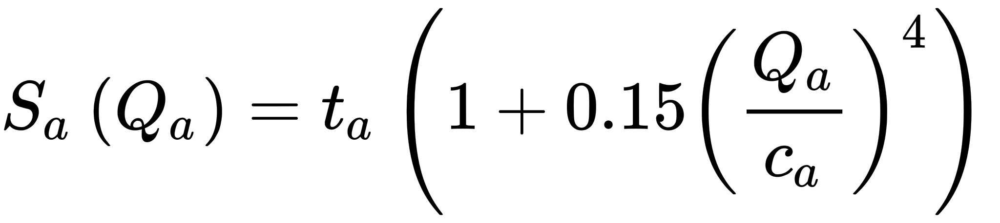

$t_a$ = free-flow travel time on link a per unit of time

$Q_a$ = flow (or volume) of traffic on link a per unit of time (somewhat more accurately: flow attempting to use link a)

$c_a$ = capacity of link a per unit of time

$S_a(Q_a)$ is the average travel time for a vehicle on link a

### User Euqilibrium

#### Mathematical Model

Passengers can not choose another route to lower their cost.

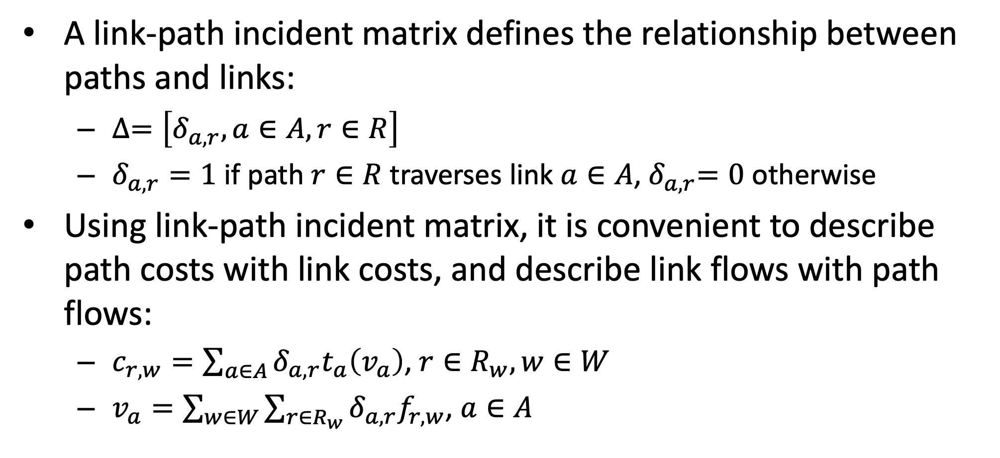

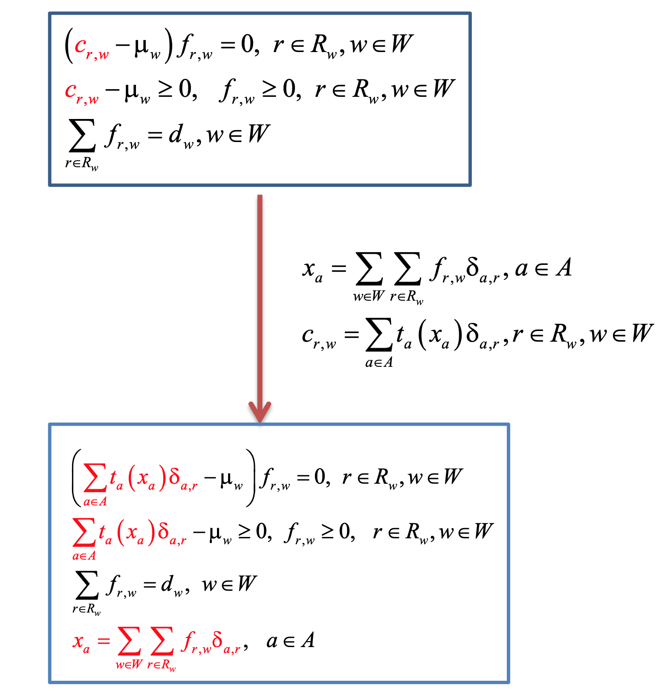

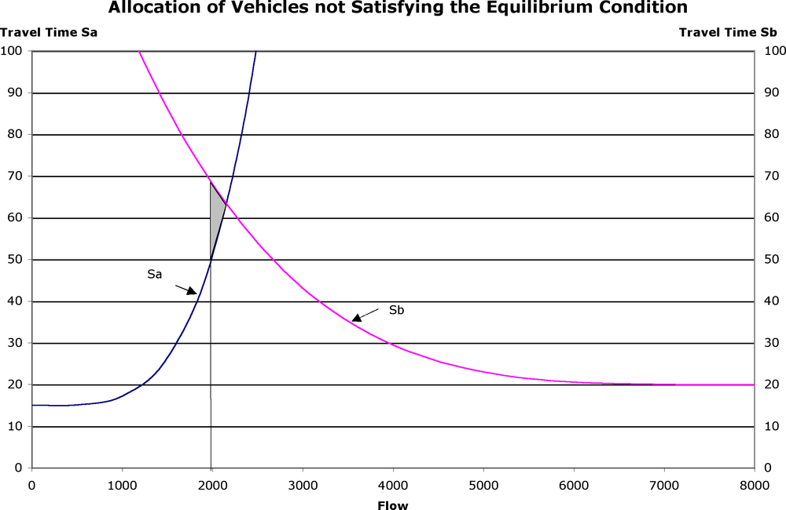

#### Heuristic method

1. All or Nothing

2. Incremental Assignment

### Beckmann's Transformation

Beckmann's transformation can convert the euqilibrium into a convex problem

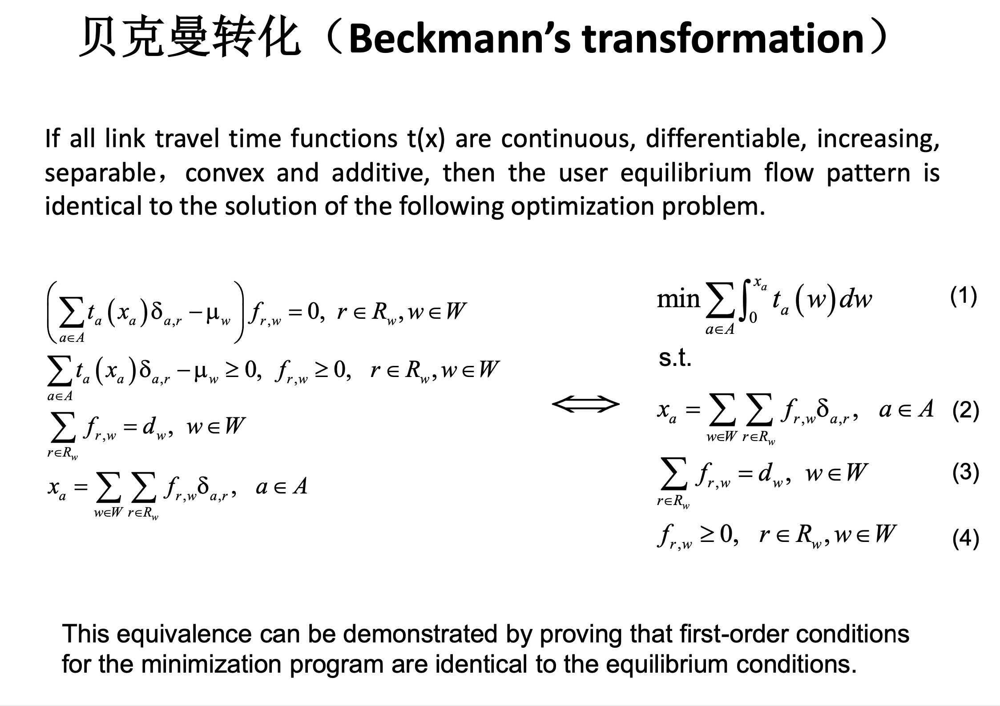

### Frank-Wolfe Algorithm

Dafermos (1968) applied the [Frank-Wolfe algorithm](https://en.wikipedia.org/wiki/Frank-Wolfe_algorithm) (1956, Florian 1976), which can be used to deal with the traffic equilibrium problem. 

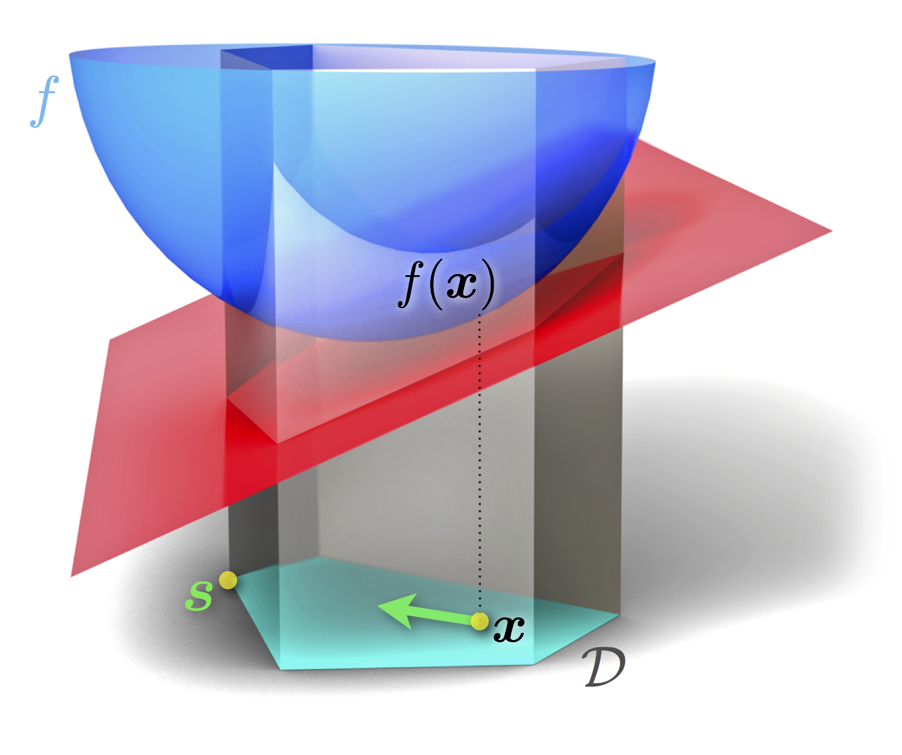

### System Optimum

#### Model Introduction

The system condition should meet the following：

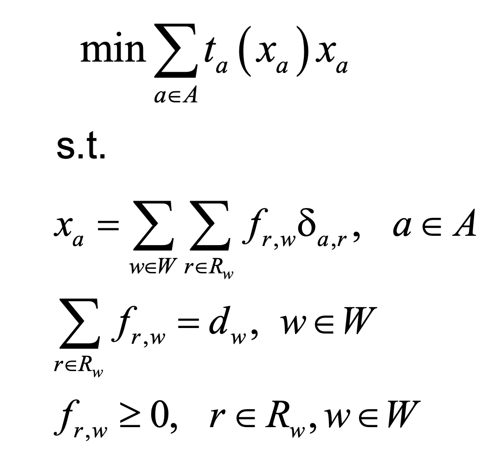

The KKT conditions of the SO problem:

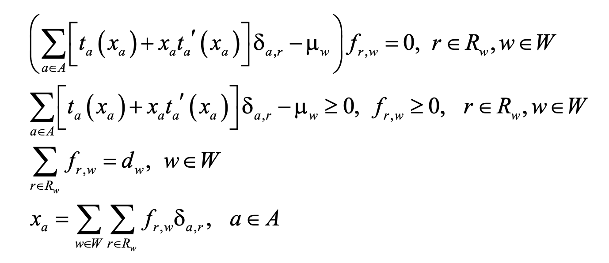

It is a simple problem to solve compared with the user euqilibrium.

#### Price of Anarchy

The reason we have congestion is that people are selfish. The cost of that selfishness (when people behave according to their own interest rather than society's) is the price of anarchy*.

The ratio of system-wide travel time under User Equilibrium and System Optimal conditions.

Price of Anarchy = 

For a two-link network with linear link performance functions (latency functions), Price of Anarchy is < 4/3.

### Network Loading Models

When there are serval choice for passengers, different ways will afford different demands. For example, if from point A to point B people can choose subway or taxi, different people will choose different ways. As a result, different approches will afford different loading.

#### Choice Function

#### Logit-Based Loading Models 

This logit modl is similar to the softmax model.

I have done a project compute the loading model using logit regression and general price which is introduced in xxx

## Network Problem

### Max-Flow Problem

### Minimum Cost Flow

## Simulation

### Random Number

### Queueing Theory

## Optimization Problem

This part contains some issues introduced in *Nocedal J, Wright S. Numerical optimization[M]. Springer Science & Business Media, 2006* and *Boyd S, Boyd S P, Vandenberghe L. Convex optimization[M]. Cambridge university press, 2004*.

### Unconstrained Optimization

**First Oder Necessary Conditions**: If $x^*$ is a local minimizer and $f$ is continuously differentiable in an open neighborhood of $x^*$, then $\nabla  f(x^∗)=0$ .

**Second Oder Necessary Conditions**: If $x^*$ is a local minimizer of $f$ and $\nabla^2f$ exists and is continuous in an open neighborhood of $x^∗$, then $\nabla f(x^*) = 0$ and $\nabla f(x^*)$ is positive semidefinite.

**Second Order Sufficient Conditions**: Suppose that $\nabla^2 f$ is continuous in an open neighborhood of $x^*$ and that $\nabla f(x^*)=0$ and $\nabla^2 f(x^*)$ is positive definite. Then $x^*$ is a strict local minimizer of $f$.

**Second-Order Sufficient Conditions**: Suppose that $\nabla^2 f$ is continuous in an open neighborhood of  $x^*$ and that $\nabla f(x^*)  = 0$ and $\nabla^2 f$ is positive definite. Then $x^*$ is a strict local minimizer of $f$.

These four theorems introduce how to obtain the local optimal of a function $f$. Moreover, if $f$ if convex, any local minimizer $x^*$ is a global minimizer. If $f$ is differentiable, then any stationary point $x^*$ is a global minimizer.

### Line Search Methods 

#### Introduction to Line Search

In the *line search* strategy, the algorithm chooses a direction $p_k$ and searches along this direction from the current iterate $x_k$ for a new iterate with a lower function value. The distance to move along $p_k$ can be found by approximately solving the following one- dimensional minimization problem to find a step length α: 

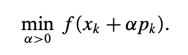

We would derive the maximum benefit from the direction $p_k$ , but an exact minimization may be expensive and is usually unnecessary. Instead, the line search algorithm generates a limited number of trial step lengths until it finds one that loosely approximates the minimum of  this objective. At the new point, a new search direction and step length are computed, and the process is repeated. 

#### Steppest Direction

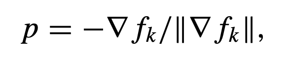

#### Newton Direction

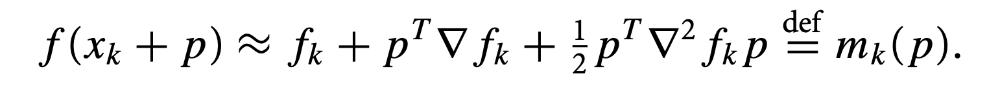

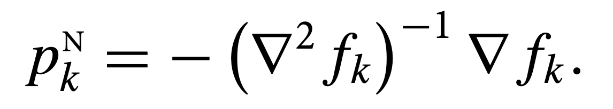

The Newton direction can be used in a line search method when $\nabla^2 f_k$ is positive definite, for in this case we have:

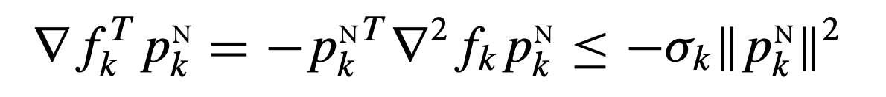

Unlike the steepest descent direction, there is a “natural” step length of 1 associated with the Newton direction. Most line search implementations of Newton’s method use the unit step $\alpha = 1$  where possible and adjust α only when it does not produce a satisfactory reduction in the value of *f* . 

中文参考资料：https://zhuanlan.zhihu.com/p/33544363

### Scaling

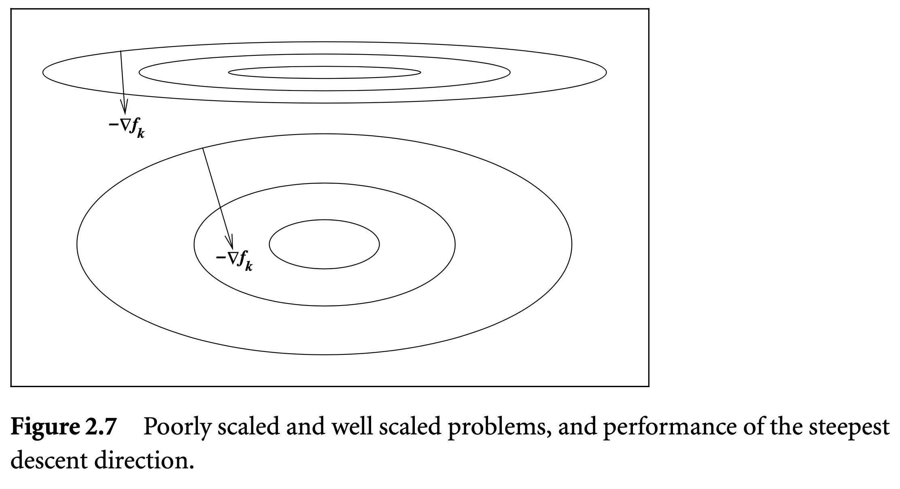

### Trust Region

Line search starts by fixing the direction $p_k$ and then identifying an appropriate distance, namely the step length $α_k$ . In trust region, we first choose a maximum distance—the trust-region radius $\Delta k$ —and then seek a direction and step that attain the best improvement possible subject to this distance constraint. If this step proves to be unsatisfactory, we reduce the distance measure $\Delta k$ and try again. 

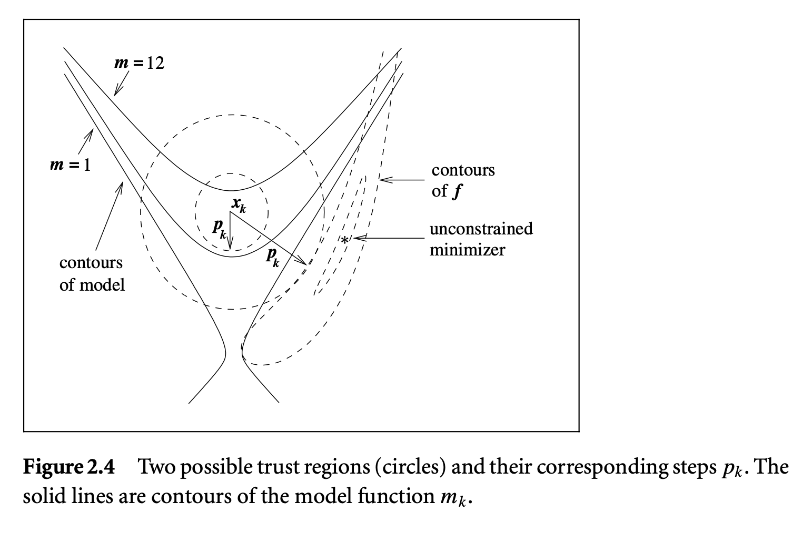

### KKT Condition

In constrained optimization problem, 

### Leat-Squared Problems

### Quasi-Newton's Method

*Quasi-Newton* search directions provide an attractive alternative to Newton’s method in that they do not require computation of the Hessian and yet still attain a superlinear rate of convergence.  In place of the true Hessian $\nabla^2 f_k$, they use an approximation $B_k$, which is updated after each step to take account of the additional knowledge gained during the step. 

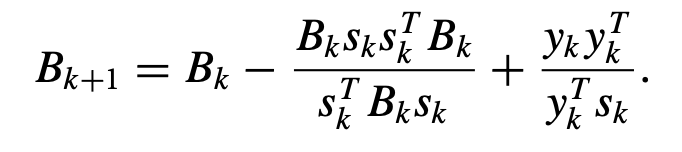

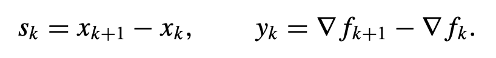

This is the BFGS update. One can show that BFGS update generates positive definite approximations whenever the initial approximation $B_0$ is positive definite and $s_k^T y_k$ > 0.

The quasi-Newton search direction is:

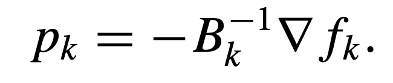

### No-linear Equation

### Dual Problem

There are several properties of dual problem.

Strong 

Weak

Shadow Price

## Integer Programming

### Branch and Bound

编辑中

### Branch and Cut

编辑中

### Branch and Price

编辑中

### Lagrangian Decomposition

编辑中

### Column Generation

编辑中

### DW Decomposition

编辑中

### Bender Decomposition

编辑中

### Iterated Local Search

Local search is a heuristic approch for integer programming. This approache will limit the searching region and search the local region of the initial solution iteratively. However, the solution time depends on the initial solution and it may fall into local optimum.

## Reinforcement&Online Learning

RL has been applied to many NP-hard scenarios such as travel salesman problem and convex hull problem. In many problem with less 

Online learning is similar to reinfocment learning and has more implementation scenarios. Many problems shall be solved on time and the decision will changed with the development of the environment.

These two tools will be important to pobelms in carsharing and ridesharing in the future.

## 高等数学与线性代数

### 泰勒与拉格朗日展开

### 多元二阶泰勒展开

证明过程中文版：多元函数的泰勒展开式 -  https://zhuanlan.zhihu.com/p/33316479

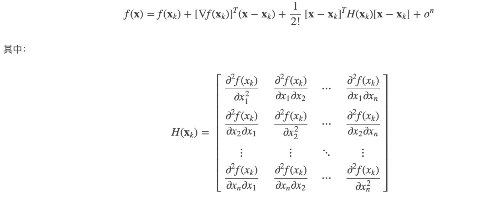

### 拉普拉斯展开

### 统计学

